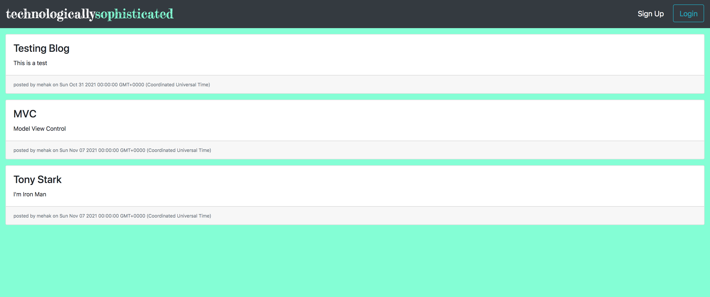
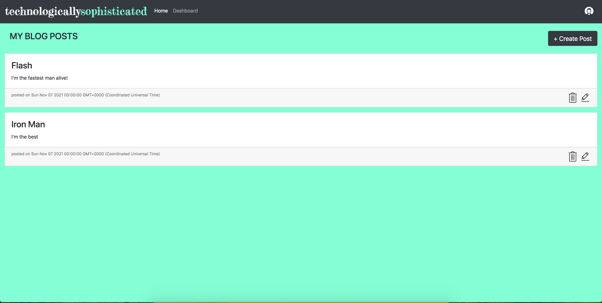
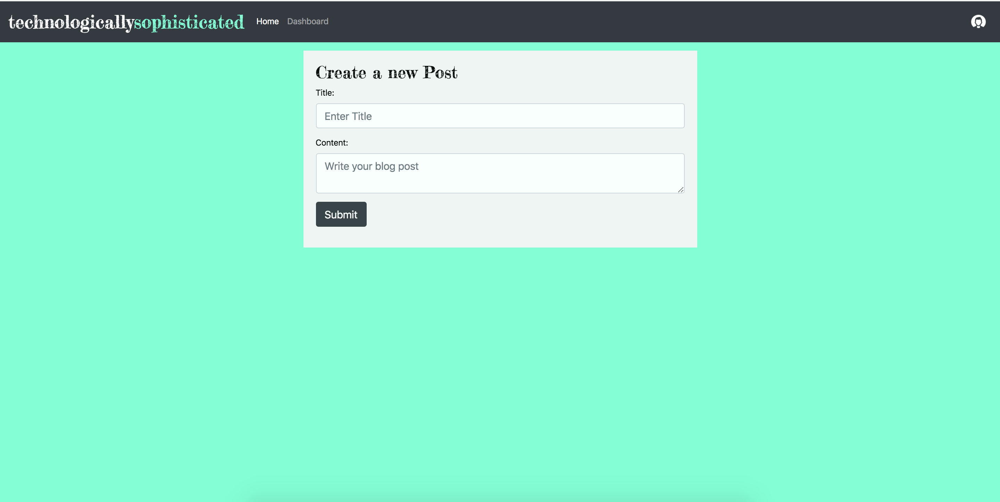
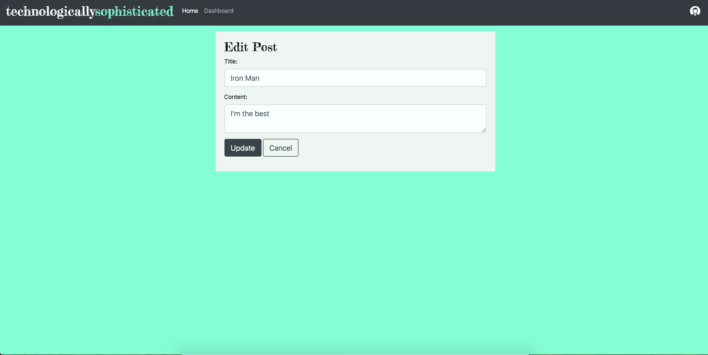
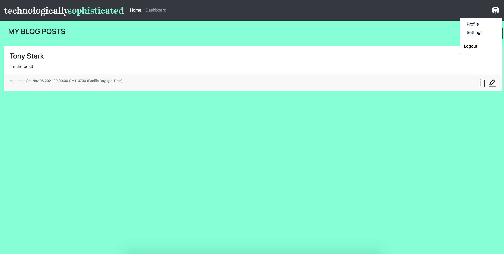

# Tech Blog
  ## Description  
  Technologically Sophiscated is a blog all about the software, technology industry. Users can read, write, and comment on blog posts that they find interesting. 

  ## Table Of Content  
  * [User Story](#userstory)
  * [Installation](#installation)
  * [Usage](#usage)
  * [Screenshots](#screeshots)
  * [Contributor](#contributor)
  * [Questions](#questions)

  ## User Story
    AS A developer who writes about tech
    I WANT a CMS-style blog site
    SO THAT I can publish articles, blog posts, and my thoughts and opinions

 ## Installation  
  To install dependencies run this command 

  ```npm install```

  ## Usage  
  Providing a space for users to learn about software engineering and technology


  ## License  
    None

## Screenshots
### Signup Page:
  
### Login Page:
  
### Home Page:
  
### Single User Dashboard:
  

### Create Post:


### Edit Post


### Logout Dropdown in Navbar


  ## Technologies

    Node.js 
    Express.js
    Template Engine handlerbars
    Mysql 
    Sequelize ORM
    bcrypt
    NPM
    RestFull APIs (Get , Post)
    HTML, CSS, Javascript
    Bootstrap

## Live Link
https://mehak-tech-blog.herokuapp.com/

## GitHub Repo Link
https://github.com/mehak-zehra/tech-blog

  ## Contributor  
  Mehak Zehra 

  ## Questions  
  - - -
  For questions about this project, please see my GitHub at [mehak-zehra](https://github.com/mehak-zehra)  (Or) 

  Contact me at mehak.rizvi.786@gmail.com